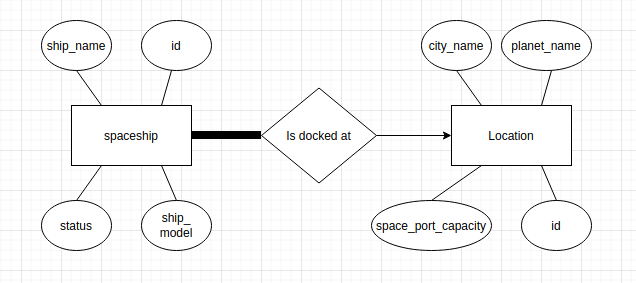

# Stomple Engineering Task

This repository is an original solution to the below task as part of an
application to Stomple's internship program by myself, Diarmuid Dwyer.
The solution is a REST API backend, which is written in python with a flask HTTP
server and a postgres sql database.

## Envrionemnt

Below is the environment in which this solution was developed
- Elementary Os version 5.1.7 (Built on Ubuntu 18.04.4 with Linux kernel 5.4.0-54-generic)
- Python version 3.6.9 64 bit
- Postgres sql version 10.15-0ubuntu0.18.04.1
- Psycopg2 ubuntu version 2.8.6 (installed via pip)
- Flask ubuntu version 1.1.2 (installed via pip)

## Description

In the distant future, humans have colonised all 8 planets in our solar system. You work for Stomble, a shipping company trying to expand their operations to the whole solar system. You have been asked to develop a system to manage the logistics of Stomble’s fleet of spaceships.
Requirements

You will develop a REST API which will store information about the location of the spaceships, as well as the locations in which they are stationed.

In order to accomplish this, your API must fulfill the following use cases:

- Add spaceships: a spaceship must have an id, name, model, location (made up of a city and a planet) and its status (decommissioned, maintenance or operational).
- Update the spaceship status: to one of the 3 possible states.
- Add a location: a location must have an id, city name and a planet name; as well as the spaceport capacity (how many spaceships can be stationed at this location simultaneously).
- Remove spaceships: given a spaceship’s id.
- Remove location: given a location’s id.
- Travel functionality: Travel involves changing the location of the spaceship and adjusting the capacity of the source and destination spaceports. Before carrying out the travel transaction, check these two factors:
    - The spaceport capacity of the destination (if not, return an appropriate error).
    - The status of the spaceship (only operational spaceships can travel).

## Notes

- Feel free to use the programming language you're most comfortable with.
- You don't have to worry about coding a frontend. However, you do need a way to show that your API functions correctly.
- Code must be placed in a public git repository (e.g. GitHub, GitLab), don’t forget to use meaningful commit messages.
- Spaceship fuel levels don’t have to be accounted for, and one can assume that they can travel to any location in a single trip.
- To simplify the task, and to avoid concurrency issues, travel from planet to planet is so fast that the time taken can be ignored (i.e. travel happens instantaneously).
- All spaceships must be stationed in a hangar somewhere, regardless of their status.
- Consider documenting and testing your API.
- If time permits, use a database.

## Database

Below is an ER representation of the database design:

Key Points:

- The total participation between spaceships and location is because all ships must be stationed at a hangar.
- Ships can only be at one location at a time, hence the many to one relation.
- Constraints on the data are outlined below.

## Data Types and Constraints

|Variable Name|Type|Constraints|
|-------------|----|-----------|
|ship_name|String||
|ship_model|String||
|status|String|Must be in {decommissioned, maintenance or operational}|
|location_id|Integer|Must coincide with an existing location id|
|ship_id|Integer|Must coincide with an existing ship id|
|city_name|String||
|planet_name|String||
|space_port_capacity|Integer|Must be > 0|

## Interface

|HTTP Request|Endpoint name|Parameters|Return type|Exception|Description|
|------------|-------------|----------|-----------|---------|-----------|
|POST|spaceship/add|(ship_id, ship_name, ship_model, status, location_id)|( is_success, info )| **ERROR** when name, model, or status are null. **ERROR** when location or status is invalid. **ERROR** when ship_id is invalid or already exists| Given a spaceships id, name, model, status and location add a spaceship to the database|
|POST|spaceship/remove|(ship_id)|( is_success, info )| **ERROR** when ship_id is invalid| Given a spaceships ship_id remove a spaceship from the database|
|POST|spaceship/update|(ship_id, status)|( is_success, info )| **ERROR** when ship_id is invalid or status is invalid| Given a spaceships ship_id and a valid status, update the spaceships status in the database|
|POST|location/add|(location_id, city_name, planet_name, space_port_capacity)|( is_success, info )| **ERROR** when city_name, planet_name or space_port_capacity are null. **ERROR** when location_id is invalid or already exists| Given a locations id, space port capacity, city and planet name add it to the database|
|POST|location/remove|(location_id)|( is_success, info )| **ERROR** when location_id is invalid or the location has ships| Given a locations id, remove the location from the database|
|POST|travel|(ship_id, location_id)|( is_success, info )|**ERROR** when location_id or ship_id are invalid. **ERROR** when the given location is full (space_port_capacity is full). **ERROR** when the ships status is not operational| Given a spaceships id and a locations id, move the spaceship to that location.|

## Example Usages

Creating the database in postgres SQL (db must be named stomple):
- createdb stomple
- psql -f db/db.sql stomple

Starting the flask server(must be from directory containing flask_server):
- python3 flask_server.py {port}

Adding a spaceship:
- curl -d 'ship_id=1&ship_name=Omega&ship_model=Alpha&status=operational&location_id=1' -X POST http://127.0.0.1:{port}/spaceship/add

Removing a spaceship:
- curl -d 'ship_id=1' -X POST http://127.0.0.1:{port}/spaceship/remove

Updating a spaceship:
- curl -d 'ship_id=1&status=decommissioned' -X POST http://127.0.0.1:{port}/spaceship/update

Adding a location:
- curl -d 'location_id=1&city_name=paris&planet_name=earth&space_port_capacity=2' -X POST http://127.0.0.1:{port}/location/add

Removing a location:
- curl -d 'location_id=1' -X POST http://127.0.0.1:{port}/location/remove

"Travelling" a ship:
- curl -d 'name=Omega&model=Alpha&status=operational&location=1' -X POST http://127.0.0.1:{port}/spaceship/add
